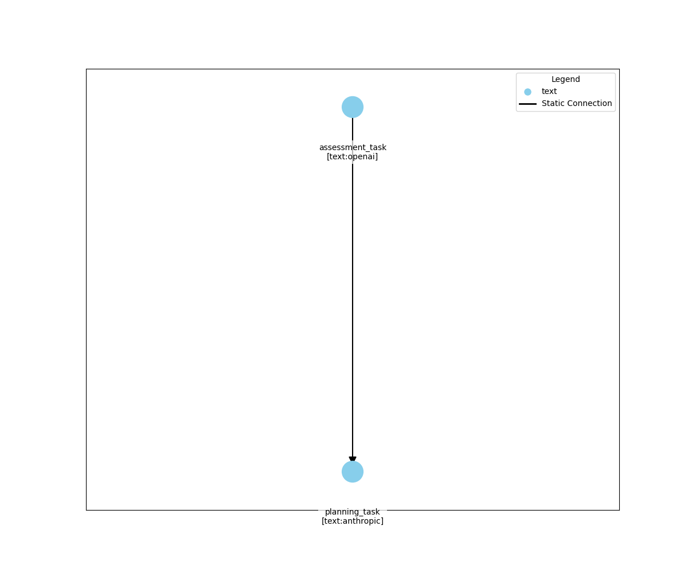
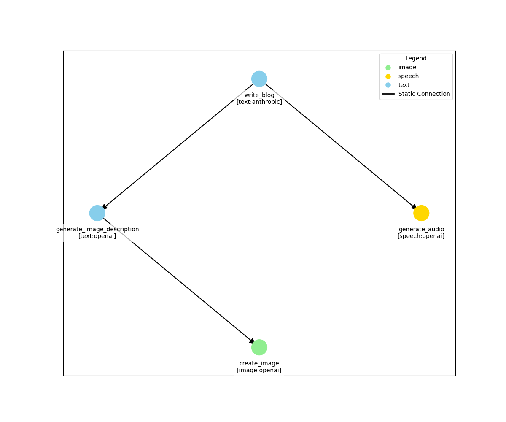
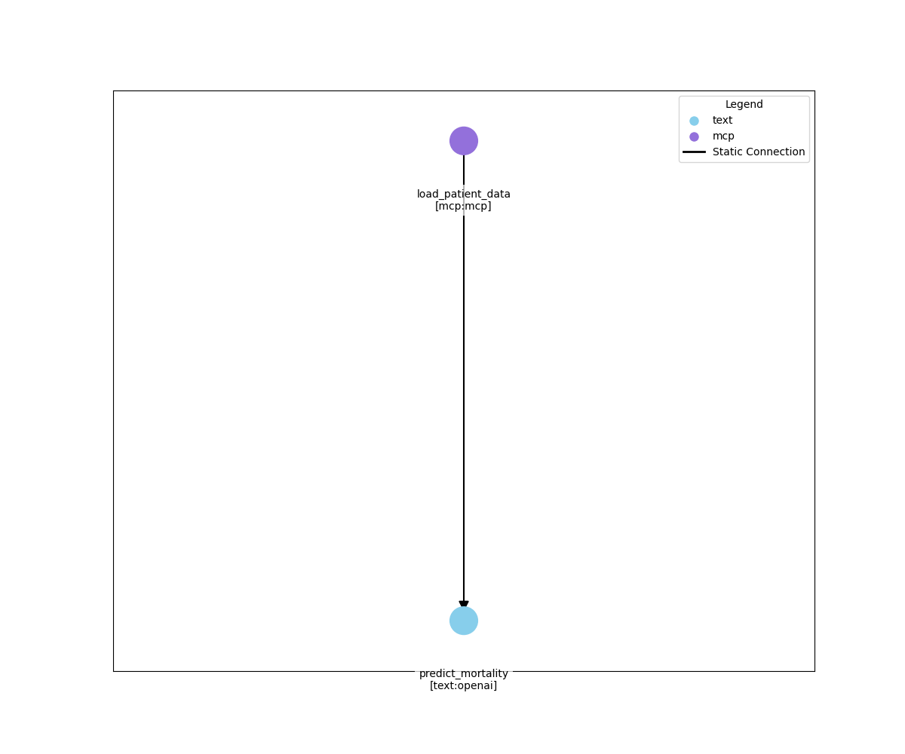

# IntelliNode Medical Use Cases


IntelliNode is an open-source library for orchestrating AI workflows using graph-based architectures. This repository contains educational examples demonstrating how multi-agent systems can be applied to healthcare and wellness scenarios.


## Install Intellinode

```bash
# Basic installation
pip install intelli

# With MCP support
pip install "intelli[mcp]"
```

## Environment Setup

Create a `.env` file in the project root with these keys:

```
OPENAI_API_KEY=your_openai_api_key_here
ANTHROPIC_API_KEY=your_anthropic_api_key_here
```

Install project dependencies:
```
pip install -r requirements.txt
```

Launch Jupyter:
```
jupyter lab
```


## MCP Server
To run the MCP server that serves CSV files using Polars:
```shell
pip install -r requirements.txt
cd mcp_server
# polars data provider
python eicu_mcp_server_polars.py
```

(Alternative) Start the server using the Pandas as data provider:
```shell
python eicu_mcp_server.py
```

## Lab Overview

### Lab 1: Nutrition Assessment with IntelliNode
- OpenAI GPT-4 analyzes client notes, Anthropic Claude creates meal plans.
- Demonstrates connecting multiple AI providers in healthcare workflows.



### Lab 2: Multiple Models with IntelliNode  
- Showcases text, image, and speech generation in one system.



### Lab 3: MCP Medical Prediction with Graph
- Medical prediction system using Model Context Protocol (MCP).
- MCP server serves CSV files using Polars backend.
- Agents predict outcomes from clinical data.



## ⚠️ Important Disclaimer

These examples are provided for educational purposes only, and are not intended for actual patient care as presented.

For production deployments, you must implement logging, secure clinical approvals, and establish appropriate governance around the workflow.


## Lab Contribution
The use case and examples in this repository were provided by [MedWrite.ai](https://medwrite.ai/).

